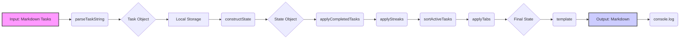

# Points-Bolt

## Project Purpose

Points-Bolt is a personal task management and productivity tool designed to help users track their tasks, points, and streaks. It aims to provide a flexible and customizable way to manage daily activities, track progress, and maintain motivation. The core idea is to assign points to tasks, track completion streaks, and provide a visual representation of progress.

## Implementation Details

### Core Functionality

The application is built using JavaScript and leverages several key concepts:

-   **Task Parsing**: Tasks are parsed from a markdown-like format, allowing for easy input and organization.
-   **Tagging System**: Tasks can be tagged with categories and timing information, enabling flexible filtering and sorting.
-   **Point System**: Points are awarded for completed tasks, providing a sense of accomplishment and progress.
-   **Streak Tracking**: The application tracks completion streaks to encourage consistent task completion.
-   **Data Persistence**: Task data is stored in local storage, ensuring that progress is saved between sessions.
-   **Day-by-Day Limits**: The application calculates and displays daily task limits to prevent overcommitment.
-   **Quadrant System**: Tasks are categorized into quadrants based on their timing and category tags.

### Key Modules

-   **`src/index.js`**: Entry point of the application, responsible for initializing the core modules.
-   **`src/core.js`**: Core logic of the application, including state management, task processing, and data manipulation.
-   **`src/parseTaskString.js`**: Parses task strings, extracts tags, and calculates task positions.
-   **`src/parsers/index.js`**: Exports all parsers.
-   **`src/parsers/utils.js`**: Utility functions for parsing tasks.
-   **`src/parsers/alias.js`**: Parses aliases for dates.
-   **`src/parsers/doneTasks.js`**: Parses done tasks.
-   **`src/parsers/mdTemplate.js`**: Creates the markdown template.
-   **`src/parsers/points.js`**: Parses points.
-   **`src/parsers/streaks.js`**: Parses streaks.
-   **`src/parsers/tabs.js`**: Parses tabs.
-   **`src/dayByDayLimits.js`**: Calculates and displays day-by-day task limits.
-   **`src/sortTasks.js`**: Sorts tasks based on their position.
-   **`src/splitTaskString.js`**: Splits task strings into tags and task descriptions.
-   **`src/catDict.js`**: Defines the category dictionary.
-   **`src/taggingDict.js`**: Defines the tagging dictionary.
-   **`src/taggingNodes.js`**: Defines the tagging nodes.
-   **`src/tasks.js`**: Defines the tasks.
-   **`src/quads/index.js`**: Defines the quadrants.
-   **`src/createTagTree.js`**: Creates the tag tree.
-   **`src/linearScale.js`**: Defines the linear scale.

### Data Flow

The following Mermaid chart illustrates the data flow within the application:

### Detailed Data Flow Explanation

1.  **Input: Markdown Tasks**: The application starts with a markdown-formatted string containing tasks, points, and other relevant information.
2.  **`parseTaskString`**: This function takes each task string, splits it into tags and task descriptions, and parses the tags to extract timing and category information.
3.  **Task Object**: The result of `parseTaskString` is a task object containing the task description, tags, and calculated position.
4.  **Local Storage**: The task object is stored in local storage for persistence.
5.  **`constructState`**: This function reads the markdown input and constructs the initial application state, including points, task lists, streaks, and tabs.
6.  **State Object**: The result of `constructState` is a state object containing all the application data.
7.  **`applyCompletedTasks`**: This function updates the state by adding points for completed tasks.
8.  **`applyStreaks`**: This function updates the state by applying streak bonuses.
9.  **`sortActiveTasks`**: This function sorts the active tasks based on their position.
10. **`applyTabs`**: This function applies tab-related logic to the state.
11. **Final State**: The result of the state transformations is the final application state.
12. **`template`**: This function takes the final state and generates a markdown string.
13. **Output: Markdown**: The markdown string is the final output of the application.
14. **`console.log`**: The markdown string is logged to the console.

## Refactoring Plan

The current project has a lot of tightly coupled logic and could benefit from a thorough refactoring. Here's a plan to improve the codebase:

### 1. Decouple Core Logic

-   **Problem**: The `core.js` file is doing too much. It's responsible for state management, task processing, and output formatting.
-   **Solution**: Break down `core.js` into smaller, more focused modules.
    -   Create a `stateManager.js` to handle state construction and updates.
    -   Create a `taskProcessor.js` to handle task parsing, sorting, and filtering.
    -   Create a `outputFormatter.js` to handle markdown output.
-   **Implementation**:
    1.  Move the `constructState`, `applyCompletedTasks`, `applyStreaks`, `sortActiveTasks`, and `applyTabs` functions to `stateManager.js`.
    2.  Move the task sorting logic to `taskProcessor.js`.
    3.  Move the markdown template logic to `outputFormatter.js`.
    4.  Update `core.js` to import and use these new modules.

### 2. Improve Task Parsing

-   **Problem**: The `parseTaskString.js` file is complex and tightly coupled with the state.
-   **Solution**: Create a dedicated `taskParser.js` module to handle task parsing and tag extraction.
-   **Implementation**:
    1.  Move the `parseTags`, `convertDateToValue`, `deriveValueFromTimingTag`, `getCategoryVector`, and `parseTaskString` functions to `taskParser.js`.
    2.  Update `core.js` and other modules to import and use the new `taskParser.js` module.

### 3. Enhance Modularity

-   **Problem**: Several modules are tightly coupled and hard to test.
-   **Solution**: Create more focused modules with clear responsibilities.
    -   Create a `dateUtils.js` module for date-related functions.
    -   Create a `localStorageManager.js` module for local storage interactions.
-   **Implementation**:
    1.  Move date-related functions from `dayByDayLimits.js` and `parseTaskString.js` to `dateUtils.js`.
    2.  Create a `localStorageManager.js` module to handle local storage interactions.
    3.  Update all modules to use the new `dateUtils.js` and `localStorageManager.js` modules.

### 4. Implement Unit Tests

-   **Problem**: The current codebase lacks unit tests, making it hard to verify changes.
-   **Solution**: Write unit tests for all core modules.
-   **Implementation**:
    1.  Set up a testing framework (e.g., Jest).
    2.  Write unit tests for `stateManager.js`, `taskProcessor.js`, `outputFormatter.js`, `taskParser.js`, `dateUtils.js`, and `localStorageManager.js`.

### 5. Improve Code Readability

-   **Problem**: The code is not always easy to read and understand.
-   **Solution**: Apply consistent formatting and naming conventions.
-   **Implementation**:
    1.  Use a code formatter (e.g., Prettier) to ensure consistent formatting.
    2.  Use descriptive variable and function names.
    3.  Add comments to explain complex logic.

### 6. Refactor Tagging System

-   **Problem**: The tagging system is complex and hard to maintain.
-   **Solution**: Refactor the tagging system to be more flexible and maintainable.
-   **Implementation**:
    1.  Create a `tagManager.js` module to handle tag parsing and manipulation.
    2.  Update all modules to use the new `tagManager.js` module.

### 7. Refactor Quadrant System

-   **Problem**: The quadrant system is not well-defined and hard to understand.
-   **Solution**: Refactor the quadrant system to be more flexible and maintainable.
-   **Implementation**:
    1.  Create a `quadrantManager.js` module to handle quadrant logic.
    2.  Update all modules to use the new `quadrantManager.js` module.

### 8. Refactor Day-by-Day Limits

-   **Problem**: The day-by-day limits logic is complex and hard to maintain.
-   **Solution**: Refactor the day-by-day limits logic to be more flexible and maintainable.
-   **Implementation**:
    1.  Create a `dayByDayManager.js` module to handle day-by-day limits logic.
    2.  Update all modules to use the new `dayByDayManager.js` module.

### 9. Refactor Linear Scale

-   **Problem**: The linear scale logic is not well-defined and hard to understand.
-   **Solution**: Refactor the linear scale logic to be more flexible and maintainable.
-   **Implementation**:
    1.  Create a `linearScaleManager.js` module to handle linear scale logic.
    2.  Update all modules to use the new `linearScaleManager.js` module.

### 10. Refactor Cat Dictionary

-   **Problem**: The cat dictionary logic is not well-defined and hard to understand.
-   **Solution**: Refactor the cat dictionary logic to be more flexible and maintainable.
-   **Implementation**:
    1.  Create a `catDictionaryManager.js` module to handle cat dictionary logic.
    2.  Update all modules to use the new `catDictionaryManager.js` module.

### 11. Refactor Tagging Dictionary

-   **Problem**: The tagging dictionary logic is not well-defined and hard to understand.
-   **Solution**: Refactor the tagging dictionary logic to be more flexible and maintainable.
-   **Implementation**:
    1.  Create a `taggingDictionaryManager.js` module to handle tagging dictionary logic.
    2.  Update all modules to use the new `taggingDictionaryManager.js` module.

### 12. Refactor Tagging Nodes

-   **Problem**: The tagging nodes logic is not well-defined and hard to understand.
-   **Solution**: Refactor the tagging nodes logic to be more flexible and maintainable.
-   **Implementation**:
    1.  Create a `taggingNodesManager.js` module to handle tagging nodes logic.
    2.  Update all modules to use the new `taggingNodesManager.js` module.

### 13. Refactor Tasks

-   **Problem**: The tasks logic is not well-defined and hard to understand.
-   **Solution**: Refactor the tasks logic to be more flexible and maintainable.
-   **Implementation**:
    1.  Create a `tasksManager.js` module to handle tasks logic.
    2.  Update all modules to use the new `tasksManager.js` module.

### 14. Refactor Quads

-   **Problem**: The quads logic is not well-defined and hard to understand.
-   **Solution**: Refactor the quads logic to be more flexible and maintainable.
-   **Implementation**:
    1.  Create a `quadsManager.js` module to handle quads logic.
    2.  Update all modules to use the new `quadsManager.js` module.

### 15. Refactor Create Tag Tree

-   **Problem**: The create tag tree logic is not well-defined and hard to understand.
-   **Solution**: Refactor the create tag tree logic to be more flexible and maintainable.
-   **Implementation**:
    1.  Create a `createTagTreeManager.js` module to handle create tag tree logic.
    2.  Update all modules to use the new `createTagTreeManager.js` module.

### 16. Refactor Linear Scale

-   **Problem**: The linear scale logic is not well-defined and hard to understand.
-   **Solution**: Refactor the linear scale logic to be more flexible and maintainable.
-   **Implementation**:
    1.  Create a `linearScaleManager.js` module to handle linear scale logic.
    2.  Update all modules to use the new `linearScaleManager.js` module.

### 17. Refactor Split Task String

-   **Problem**: The split task string logic is not well-defined and hard to understand.
-   **Solution**: Refactor the split task string logic to be more flexible and maintainable.
-   **Implementation**:
    1.  Create a `splitTaskStringManager.js` module to handle split task string logic.
    2.  Update all modules to use the new `splitTaskStringManager.js` module.

### 18. Refactor Parsers

-   **Problem**: The parsers logic is not well-defined and hard to understand.
-   **Solution**: Refactor the parsers logic to be more flexible and maintainable.
-   **Implementation**:
    1.  Create a `parsersManager.js` module to handle parsers logic.
    2.  Update all modules to use the new `parsersManager.js` module.

### 19. Refactor Utils

-   **Problem**: The utils logic is not well-defined and hard to understand.
-   **Solution**: Refactor the utils logic to be more flexible and maintainable.
-   **Implementation**:
    1.  Create a `utilsManager.js` module to handle utils logic.
    2.  Update all modules to use the new `utilsManager.js` module.

### 20. Refactor MD Template

-   **Problem**: The md template logic is not well-defined and hard to understand.
-   **Solution**: Refactor the md template logic to be more flexible and maintainable.
-   **Implementation**:
    1.  Create a `mdTemplateManager.js` module to handle md template logic.
    2.  Update all modules to use the new `mdTemplateManager.js` module.

### 21. Refactor Alias

-   **Problem**: The alias logic is not well-defined and hard to understand.
-   **Solution**: Refactor the alias logic to be more flexible and maintainable.
-   **Implementation**:
    1.  Create a `aliasManager.js` module to handle alias logic.
    2.  Update all modules to use the new `aliasManager.js` module.

### 22. Refactor Done Tasks

-   **Problem**: The done tasks logic is not well-defined and hard to understand.
-   **Solution**: Refactor the done tasks logic to be more flexible and maintainable.
-   **Implementation**:
    1.  Create a `doneTasksManager.js` module to handle done tasks logic.
    2.  Update all modules to use the new `doneTasksManager.js` module.

### 23. Refactor Points

-   **Problem**: The points logic is not well-defined and hard to understand.
-   **Solution**: Refactor the points logic to be more flexible and maintainable.
-   **Implementation**:
    1.  Create a `pointsManager.js` module to handle points logic.
    2.  Update all modules to use the new `pointsManager.js` module.

### 24. Refactor Streaks

-   **Problem**: The streaks logic is not well-defined and hard to understand.
-   **Solution**: Refactor the streaks logic to be more flexible and maintainable.
-   **Implementation**:
    1.  Create a `streaksManager.js` module to handle streaks logic.
    2.  Update all modules to use the new `streaksManager.js` module.

### 25. Refactor Tabs

-   **Problem**: The tabs logic is not well-defined and hard to understand.
-   **Solution**: Refactor the tabs logic to be more flexible and maintainable.
-   **Implementation**:
    1.  Create a `tabsManager.js` module to handle tabs logic.
    2.  Update all modules to use the new `tabsManager.js` module.

### Step-by-Step Refactoring Guide for Junior Engineers

1.  **Set Up Development Environment**:
    -   Ensure you have Node.js and npm installed.
    -   Clone the repository.
    -   Run `npm install` to install dependencies.
    -   Run `npm run dev` to start the development server.
2.  **Create New Modules**:
    -   Create the new modules as described in the refactoring plan.
    -   Start with `stateManager.js`, `taskProcessor.js`, `outputFormatter.js`, and `taskParser.js`.
3.  **Move Functions**:
    -   Carefully move the functions from `core.js` and `parseTaskString.js` to the new modules.
    -   Ensure that all imports are updated correctly.
4.  **Update Imports**:
    -   Update all modules to import and use the new modules.
    -   Pay close attention to the import paths.
5.  **Test Changes**:
    -   After each step, run the application to ensure that no functionality is broken.
    -   Write unit tests for the new modules to verify their correctness.
6.  **Refactor Other Modules**:
    -   Continue refactoring the other modules as described in the plan.
    -   Follow the same steps as above.
7.  **Code Review**:
    -   After completing the refactoring, ask a senior engineer to review your code.
    -   Address any feedback and make necessary changes.

By following this plan, the codebase will become more modular, maintainable, and testable. This will make it easier to add new features and fix bugs in the future.
